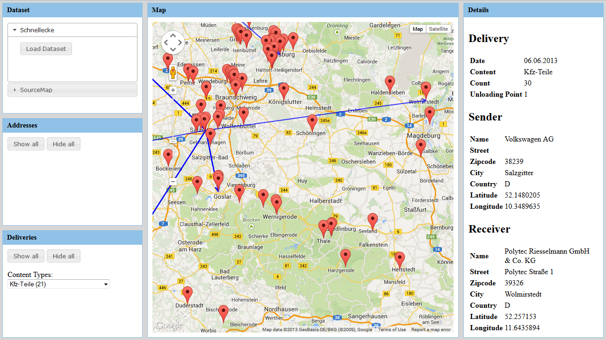

# GeoKnow Supply Chain Dashboard

Initial prototype of the supply chain dashboard, a web application that allows the user to search, browse and to explore supply chain data.

## Requirements

- JDK 6 or later
- Simple Build Tool (http://www.sbt-scala.com)
 
## Running

- Navigate to the 'apps' folder
- Execute sbt "project dashboard" run
- In your browser, navigate to 'http://localhost:9000'

## Packaging

- Navigate to the 'dashboard' folder
- Execute 'sbt dist'
- The package can be found in 'target/universal'
